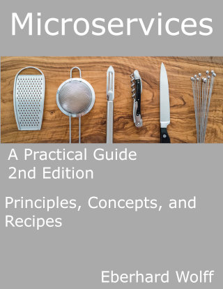

Microservices
---

## The Book

There are many technologies for microservices. This book shows the
basics of microservices, the concepts of the most important
technologies and finally concrete recipes with technologies such as
client-side and server-side frontend integration, asynchronous
microservices with Kafka or REST/Atom, synchronous systems with the
Netflix stack and Consul or microservices platforms with Kubernetes
and Cloud Foundry. In addition, there is the operation with monitoring
with Prometheus, log analysis with the Elastic stack and tracing with
Zipkin. The book thus offers a good start implementing microservices.

## German Version

The book is a translation into English. The German version is
[Microservices Praxisbuch](http://microservices-praxisbuch.de).

## 2nd Edition

The second edition is based on the feedback about the first
edition. All chapters have been clarified, updated and extended. A new
chapter discusses services meshes, in particular Istio with an example
application. The second edition has about 35 pages more than the first
edition.

## Author

Eberhard Wolff has 15+ years of experience as architect and
consultant - often at the intersection of business and technology. He
is a Fellow at INNOQ in Germany. He has given talks at international
conferences and written more than 100 articles and books e.g. about
Microservices and Continuous Delivery. His technological focus is on
modern architectures - involving Cloud, Continuous Delivery, DevOps,
Microservices or NoSQL.

