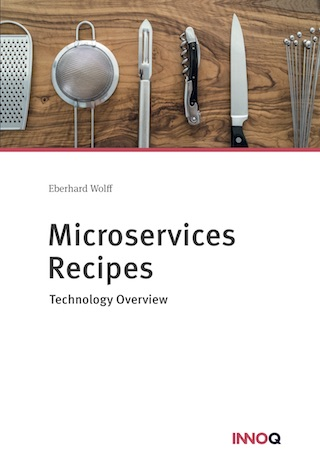

Microservices Recipes
---

This brochure includes technology recipes for the implementation of
microservices. The code for the examples can be downloaded for free.

 

## Content

* What are Microservices?
  - Independent Systems Architecture Principles
  - Self-contained Systems
  - Frontend integration

* Why frontend integration?
  - Recipe: ESI (Edge Side Includes)
  - Alternative recipe: links and JavaScript
 

* Asynchronous microservices
  - Definition: asynchronous microservices
  - Why asynchronous microservices?
  - Recipe: Kafka
  - Alternatives recipe: Atom

* Synchronous Microservices
  - Definition: synchronous microservices
  - Why synchronous microservices?
  - Recipe: Kubernetes
  - Alternative recipe: Netflix, Consul, Cloud Foundry

The last chapter explains how to deepen the knowledge about technologies for microservices further.

## Download

You can get the eBook for free from Leanpub. You get a PDF, ePub and
Mobi (Kindle). There is no DRM (digital rights management).
      
<https://leanpub.com/microservices-recipes>

At *Amazon* the Kindle eBook is not free but quite cheap. Here are the
      links to the Amazon web sites:

* [Amazon DE](http://amzn.to/2CmUFhV)
* [Amazon COM](http://amzn.to/2orb0JO)
* [Amazon UK](http://amzn.to/2HMbLVV)
* [Amazon CA](http://amzn.to/2GJQmeB)
* [Amazon ES](http://amzn.to/2CmXnnB)
* [Amazon FR](http://amzn.to/2sRoLGc)
* [Amazon IT](http://amzn.to/2FxLsSu)

## Print

If you prefer paper, there is also a printed version:

* [Amazon DE](http://amzn.to/2Fx7LI3)
* [Amazon COM](http://amzn.to/2GM688G)
* [Amazon UK](http://amzn.to/2sYYjL7)
* [Amazon CA](http://amzn.to/2CJWelA)
* [Amazon ES](http://amzn.to/2sTPKBh)
* [Amazon FR](http://amzn.to/2FwyCUP)
* [Amazon IT](http://amzn.to/2F6acDL)
