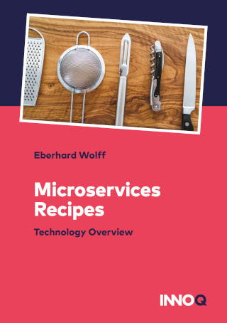

Microservices Recipes
---

This brochure includes technology recipes for the implementation of
microservices. The code for the examples can be downloaded for free.

 

## Content

* What are Microservices?
  - Independent Systems Architecture Principles
  - Self-contained Systems
  - Frontend integration

* Why frontend integration?
  - Recipe: ESI (Edge Side Includes)
  - Alternative recipe: links and JavaScript
 

* Asynchronous microservices
  - Definition: asynchronous microservices
  - Why asynchronous microservices?
  - Recipe: Kafka
  - Alternatives recipe: Atom

* Synchronous Microservices
  - Definition: synchronous microservices
  - Why synchronous microservices?
  - Recipe: Kubernetes
  - Alternative recipe: Netflix, Consul, Cloud Foundry

The last chapter explains how to deepen the knowledge about technologies for microservices further.

## Download

You can get the eBook for free from Leanpub. You get a PDF, ePub and
Mobi (Kindle). There is no DRM (digital rights management).
      
<https://leanpub.com/microservices-recipes>
